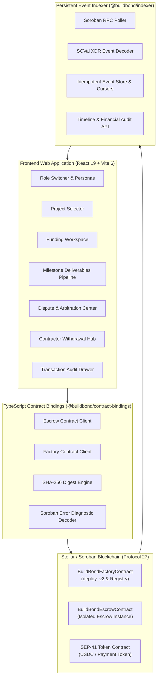
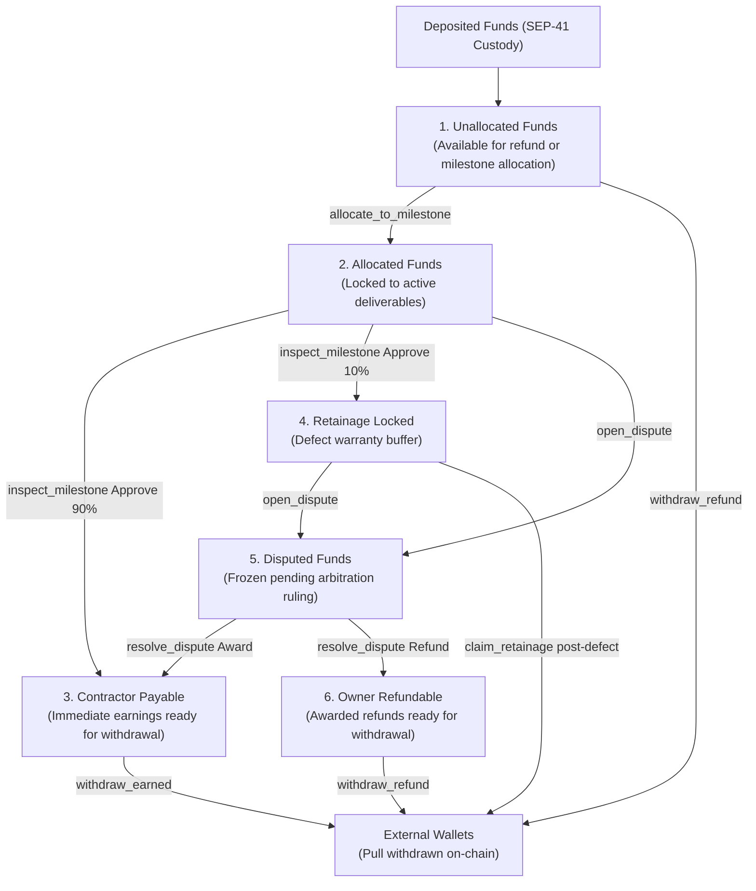

# BuildBond Architecture & Technical Specification

BuildBond is an institutional-grade construction milestone escrow, defect liability retention, and neutral arbitration protocol built on **Stellar / Soroban (Protocol 27)**.

---

## 1. High-Level Architecture Diagram



---

## 2. Monorepo Structure

```text
BuildBond/
├── apps/
│   └── web/                         # Level 1 & Level 2 Web Application (React 19, Vite 6, TypeScript 5)
│       ├── src/
│       │   ├── components/          # RoleSwitcher, MilestoneList, FundingWorkspace, DisputeCenter, etc.
│       │   ├── hooks/               # useEscrowWorkflow, useFreighter, useAccountBalance
│       │   ├── types/               # UI models, personas, transaction logs
│       │   ├── utils/               # SHA-256 hashing, error diagnostics, Stellar utilities
│       │   └── index.css            # Custom design system styling
├── contracts/
│   ├── buildbond-escrow/            # Core Escrow, Retainage & Dispute Contract (Soroban SDK 27)
│   │   └── src/
│   │       ├── lib.rs               # 21 exported contract entrypoints
│   │       ├── types.rs             # Contract domain models, state enums, custom error codes (1..37)
│   │       ├── events.rs            # 16 contract event definitions & emitters
│   │       ├── storage.rs           # Instance & persistent storage accessors
│   │       └── test.rs              # 18 comprehensive unit and property tests
│   └── buildbond-factory/           # Multi-Project Factory Contract (Soroban SDK 27)
│       └── src/
│           ├── lib.rs               # deploy_project (via deploy_v2), wasm_hash updates, registry
│           ├── types.rs             # ProjectMetadata and FactoryError codes
│           ├── events.rs            # ProjectDeployedEvent, WasmHashUpdatedEvent
│           ├── storage.rs           # Participant-to-project reverse index storage
│           └── test.rs              # Factory unit and registry tests
├── packages/
│   ├── contract-bindings/           # TypeScript contract client generated directly from WASM bytecodes
│   └── shared/                      # Shared types, network constants, contracts.json, config loaders
├── services/
│   └── indexer/                     # Persistent Soroban RPC event indexing daemon and query service
│       └── src/
│           ├── eventDecoder.ts      # SCVal XDR deserializer for all 16 event types
│           ├── rpcClient.ts         # Resilient getEvents poller with retry backoff
│           ├── storage.ts           # Memory/persistent event store with cursor checkpoints
│           ├── service.ts           # Indexer background daemon
│           ├── query.ts             # Milestone timeline & financial audit aggregators
│           └── indexer.test.ts      # Indexer test suite
├── scripts/                         # Automated deployment, friendbot funding, and verification scripts
├── docs/                            # Deployment runbooks and technical documentation
├── Cargo.toml                       # Cargo workspace configuration (Protocol 27, opt-level "z", LTO)
└── package.json                     # Monorepo root with unified test, type-check, and build orchestration
```

---

## 3. Financial Accounting Model (The 6-Bucket Invariant)

To guarantee absolute financial conservation without custodial leakage, every escrow contract maintains an explicit 6-bucket asset/liability ledger:



### Invariant Theorem:
$$\text{Accounted Active Funds} = \text{Allocated} + \text{Contractor Payable} + \text{Retainage Locked} + \text{Disputed} + \text{Owner Refundable}$$
$$\text{Unallocated Funds} = \text{Deposited} - (\text{Accounted Active Funds} + \text{Withdrawn})$$
$$\text{Deposited} = \text{Allocated} + \text{Payable} + \text{Retainage} + \text{Disputed} + \text{Refundable} + \text{Withdrawn} + \text{Unallocated}$$

---

## 4. Key State Transition Machines

### 4.1 Project Escrow Lifecycle
```text
[ Draft / Initialized ]
        │
        ▼ (Owner auto-accepts, Contractor/Inspector/Arbiter call accept_role)
[ AwaitingAcceptance ]
        │
        ▼ (All 4 parties accept terms hash)
[ AwaitingFunding ] / [ Active ]
        │
        ▼ (Milestones progress, completed, defect periods mature)
[ Completed ]
```

### 4.2 Milestone Deliverable Pipeline
```text
[ Planned ] ──(deposit & allocate)──> [ Funded ] ──(contractor submit)──> [ Submitted ]
                                                                             │
                                              ┌──────────────────────────────┴──────────────────────────────┐
                                              ▼ (inspector reject)                                          ▼ (inspector approve)
                                       [ Rejected ]                                                  [ InDefectPeriod ]
                                              │ (rework)                                                    │
                                              └───────> [ Submitted ]                                       ▼ (defect timer expires)
                                                                                                    [ RetainageClaimable ]
                                                                                                            │ (contractor claim)
                                                                                                            ▼
                                                                                                    [ Settled ]
```

### 4.3 Defect Clock Freezing & Arbitration Flow
```text
[ Submitted / Rejected / InDefectPeriod ]
        │
        ▼ (Owner or Contractor calls open_dispute)
[ Disputed ]
  • Milestone funds or locked retainage moved to accounting.disputed
  • If in defect period: frozen_remaining_secs = defect_deadline_at - ledger.timestamp()
        │
        ▼ (Neutral Arbiter calls resolve_dispute with split award)
[ Settled ]
  • accounting.disputed reallocated to contractor_payable and owner_refundable
  • Binding award emitted and recorded on-chain
```

---

## 5. Cryptographic Digest Schema

All off-chain documents and commitments are bound on-chain using canonical SHA-256 hashes:

| Commitment Type | Target Content | Hash Structure |
| :--- | :--- | :--- |
| **Canonical Terms Hash** | Project title, parties, payment token, commitment, retainage bps, defect period, milestone schedule | `SHA-256(canonical_json(terms))` |
| **Evidence Digest** | Milestone ID, engineering submittal notes, attached document contents | `SHA-256(milestone_id || notes || file_bytes)` |
| **Inspection Report Digest** | Milestone ID, inspector decision (Approve/Reject), engineering notes | `SHA-256(milestone_id || decision || notes)` |
| **Dispute Reason Hash** | Milestone ID, initiator statement of non-conformance | `SHA-256(milestone_id || "Reject" || statement)` |
| **Arbitration Award Digest** | Milestone ID, contractor award, owner refund, ruling findings | `SHA-256(milestone_id || "Approve" || findings)` |

---

## 6. Real-Time Indexer Service Architecture

The `@buildbond/indexer` service targets Soroban RPC `getEvents`:

1. **Poller Loop**: Queries ledgers between `cursor.lastLedger + 1` and `latestLedger`.
2. **SCVal Deserializer**: Translates raw topics and payloads into strongly-typed domain events.
3. **Storage Engine**: Stores events in an indexed, deduplicated repository with cursor bookmarking.
4. **Aggregation Layer**: Assembles instant milestone timelines and comprehensive financial audit ledgers.
